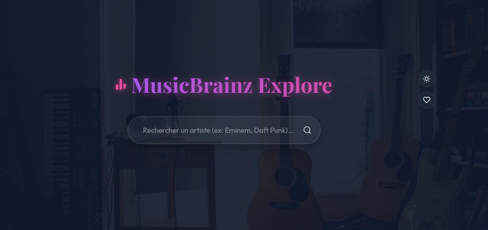
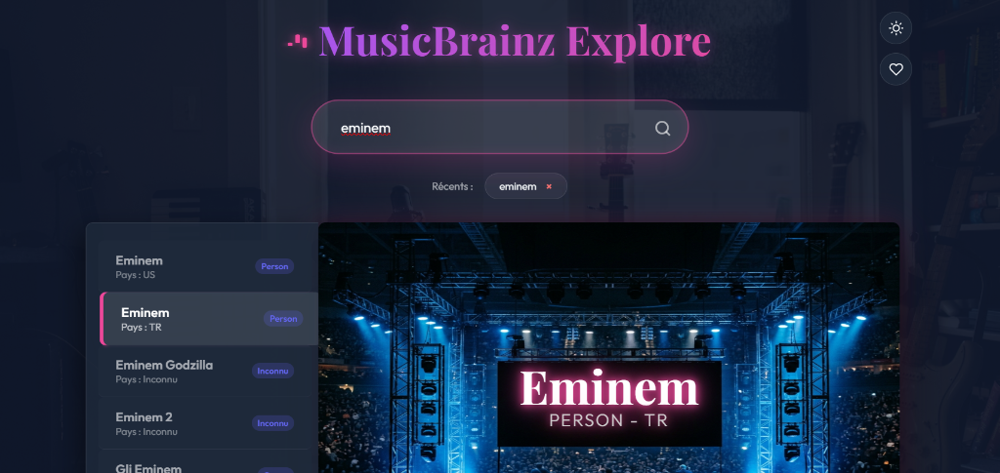
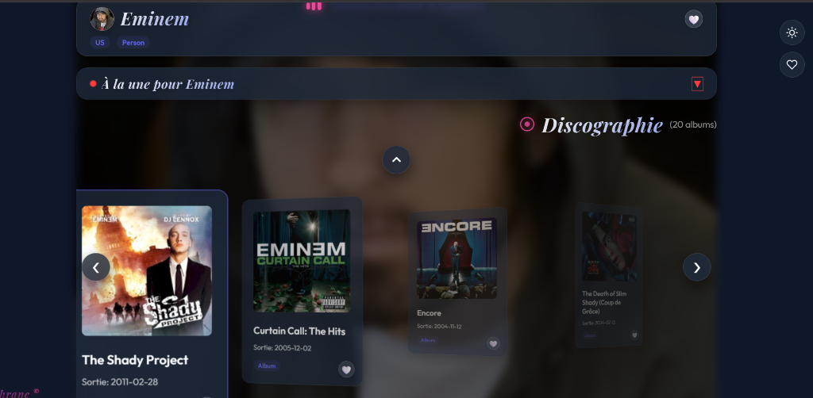

# Application Musicale Interactive 🎵

Bienvenue dans ce projet d'application web moderne dédiée à l'exploration musicale. Cette application permet aux utilisateurs de rechercher leurs artistes favoris, de parcourir leur discographie (albums et chansons), et de suivre leur actualité en temps réel.

## 🚀 Le Sujet de l'Application

L'objectif de cette plateforme est d'offrir une expérience utilisateur (UX) haut de gamme et immersive. Lorsqu'un utilisateur recherche un artiste, l'application lui présente :
- Une belle interface avec la photo de l'artiste en arrière-plan.
- La liste complète de ses albums sous forme de carrousel interactif.
- Les pistes de chaque album avec des liens d'écoute directe.
- Un flux d'actualités en direct alimenté par les recherches récentes de presse, totalement intégré.

## 🎨 L'Interface Web (React)

L'interface a été conçue pour être **chic, réactive et intuitive** :
- **Mode Sombre / Mode Clair** : L'application s'adapte automatiquement et harmonieusement à vos préférences de luminosité.
- **Design Moderne** : Utilisation de typographies élégantes (Playfair Display, Outfit), d'animations fluides, d'effets de verre (glassmorphism) et d'un panneau d'accordéon pour l'actualité.
- **Sauvegarde Intelligente** : Les recherches et les préférences de l'utilisateur sont mémorisées localement.

## ⚙️ Les Technologies Utilisées

Le projet est divisé en deux parties distinctes :

1. **Backend : Python (FastAPI)**
   - API ultra-rapide servant de passerelle entre le front-end et des sources de données externes.
   - Lecture de flux RSS (Google Actualités) traitée en arrière-plan sans nécessiter de clés d'API.
2. **Frontend : React (Vite)**
   - Interface utilisateur dynamique développée en JavaScript/React.
   - Routage local, gestion d'états asynchrones et CSS pur sur mesure.

## 🔗 Intégration MCP (Model Context Protocol)

Le projet a été pensé pour pouvoir s'interfacer avec l'écosystème **MCP (Model Context Protocol)**. 
Grâce à ce standard, des agents IA externes peuvent se connecter directement aux outils de l'application ou à des sources externes (comme des outils de recherche web ou de génération d'images) pour enrichir dynamiquement le contenu présenté à l'utilisateur (par exemple, agréger des actualités en temps réel).

## 💻 Comment Lancer le Projet

### 1. Démarrer le Serveur Backend (Python)
Ouvrez un terminal à la racine du projet et exécutez :
```bash
pip install -r requirements.txt
python main.py
```
*Le serveur démarrera sur `http://127.0.0.1:8000`.*

### 2. Démarrer l'Interface Frontend (React)
Ouvrez un second terminal, allez dans le dossier de l'interface, installez les dépendances et lancez Vite :
```bash
cd interface_utilisateur
npm install
npm run dev
```
*L'application sera accessible dans votre navigateur (généralement sur `http://localhost:5173`).*

---

## 📸 Aperçu de l'Interface

Voici quelques captures d'écran illustrant le design haut de gamme, les animations et l'expérience immersive de l'application :

### 1. Écran d'Accueil Épuré (Effet Spotlight & Verre)


### 2. Théâtre de Recherche & Écran Géant de Projection
*Lorsque vous lancez une recherche, les résultats glissent sous forme de panneau latéral à gauche tandis que l'écran géant central projette les détails avec un halo de scène néon.*


### 3. Fiche Artiste Complète & Carrousel de Discographie
*La flèche de retour et le panneau d'actualités s'ajustent dynamiquement. La flèche reste collée de manière intelligente juste au-dessus du rectangle de l'album central actif.*


---

*Note : Ce projet a été développé en collaboration et avec l'assistance d'agents d'Intelligence Artificielle de nouvelle génération.*
